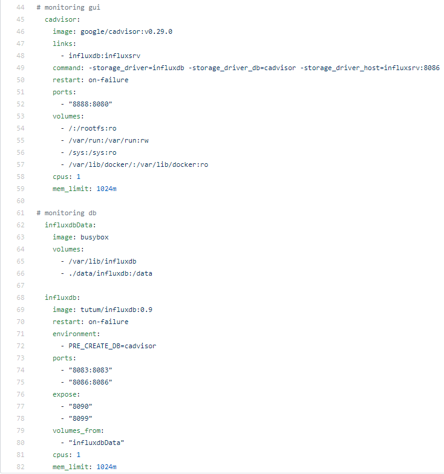

#  Dokumentation LB3 Lucas Gamper 

# K1 / K2

## Persönlicher Stand

Ich habe bezüglich Docker, Microservics und Container kaum Erfahrung. Ich kenne ein wenig von der Theorie aus dem Modul 300 und ÜK 340 mehr aber auch nicht. Was genau Technisch im Hintergrund abgeht weiss ich nicht. Ich verwende zwar täglich Container wie YouTube oder Gmail und weiss, dass diese immer mehr an Popularität gewinnen, wie diese einzurichten sind weiss ich jedoch nicht. Ich bin gespannt mit Docker etwas mehr über Container zu lernen.

Da ich wie gesagt nur begrenztes Vorwissen habe, habe ich zuerst einmal die Unterlagen auf dem BSCW durchgelesen. Anschliessend habe ich mir noch ein Basic Docker Tutorial auf YouTube angeschaut.

## Einrichten

### Git bash

1. Git bash herunterladen 
2. Git bash installieren

Anschliessend wird noch das Repository auf den lokalen Computer kopiert.

$ git clone https://github.com/mc-b/M300      #Repository klonen
 
  
### GitHub Account

1. GitHub Account erstellen
2. Mit Git bash SSH Key erstellen
 $ ssh-keygen -t rsa 4096 -C "lucas.gamper@edu.tbz.ch"
3. SSH Key dem Agent hinzufügen
4. SSH Key dem GitHub Konto hinzufügen

### Virtualbox

1. Virtualbox herunterladen
2. Virtualbox installieren

### Visual Studio Code

1. Visual Studio Code herunterladen
2. Visual Studio Code installieren
3. Extensions installieren
4. Einstellungen anpassen

### Vagrant

1. Vagrant herunterladen
2. Vagrant installieren
3. Vagrant VM erstellen

### Docker

1. Docker Account erstellen auf www.docker.com
2. Docker Desktop für Windows installieren (neustart benötigt)

# K3

### Geplante Umgebung:

Für die LB3 werde ich wie bei der LB2 einen Webserver aufsetzen welcher die Verwaltung der MySQL Datenbank ermöglicht. Diese beiden Container werden in einem einzigen Docker Image erstellt. Zusätzlich kommt noch phpmyadmin aus einem anderen Image um die Kombination von zwei verschiedenen Container zu ermöglichen. Ausserdem wird auf der Datenbank ein persistentes Volume erstellt und es werden Sicherheitsmassnahme und ein Monitoring umgesetzt.

# Docker Befehle

| Befehl           |Beschreibung                                                                                   |
| -----------------|:---------------------------------------------------------------------------------------------:|
| Docker run       |Startet neuen Container - Der Befehl bietet unzählige Optionen und Parameter für Konfiguration |
| Docker run -it ubuntu /bin/bash       |Startet einen Container mit einer interaktiven Shell                      |
| Docker run -d ubuntu touch /tmp/lok      |Startet einen Container im Hintergrund und legt eine Datei an          |                     
| Docker ps        |Gibt einen Überblick über alle aktuellen Container                                             | 
| Docker ps -a     |Aktive und gestoppte Container anzeigen (All)                                                  | 
| Docker container ls -q |Gibt die ID aller laufenden Container an.                                                |
| Docker images    |Gibt Liste von lokalen Images aus (Repository-Name, Tag-Name, und Grösse)                      | 
| Docker rm        |Löscht einen oder mehrere Container. Gibt ID's aller Erfolgreich gelöschten Container zurück   | 
| Docker rmi       |Löscht das angegebene Image. Diese werden durcgh ID oder Tag-Name spezifiziert.                |
| Docker start     |Startet einen oder mehrere Container, welche gestoppt wurden (Nur starten nicht erstellen).    |
| Docker stop      |Stoppt einen oder mehrere Container(Herunterfahren).                                           |
| Docker kill      |Der Container wird sofort gestoppt und anschliessend gelöscht.                                 |
| Docker logs      |Gibt die Logs für einen Container aus.                                                         |
| Docker inspect   |Gibt umfangreiche Info über Container und Image(Konfigurationen, Netzwerkeinstellungen etc.)   |
| Dokcer diff      |Gibt Änderungen am Dateisystem an, gegenüber dem Image welches verwendet wurde.                |
| Docker top       |Gibt die aktuell laufenden Prozesse an(Task Manager).                                          |
| Docker build -t "name" |Erstellt Image aus dem Dockerfile im Verzeichniss                                        |
| Docker login     |Mit Docker Credentials in dieser CLI Situng anmelden                                           |
| Docker stack ls  |Zeigts Stacks oder Apps an.                                                                    |
| Docker stack rm "appname" |Entfernt eine App.                                                                    |

Es gibt noch viele andere Befehle und Parameter in Docker, ich habe hier aber nur ein paar Beispiele aufgelistet. 

# Funktionstests

Um die Funktion der Docker Container zu testen, habe ich die folgenden Testfälle durchgeführt.

- Kann auf Webserver (Localhost:80) zugegriffen werden
- Ist die Datenbank über PhPmyAdmin erreichbar
- Funktioniert das Monitoring
- Werden die Sicherheitsrichtlinien (CPU / Memory Limit) angewendet.

Die Testfälle sind hier übersichtlich dokumentiert:

| Test                                   |Erwartetes Resultat                                         |Tatsächliches Resultat|
| ---------------------------------------|------------------------------------------------------------|:--------------------:|
| Webserver erreichbar unter localhost   |Standard Webseite gibt MySQL Verbindungstatus zurück.       |Funktioniert          |
| MySQL über PhPmyAdmin erreichbar       |PhPmyAdmin login funktioniert auf MySQL                     |Funktioniert          |
| Monitoring per Cadvisor ist erreichbar |CAdvisor ist erreichbar und kommuniziert mit der DB         |Funktioniert          |
| Monitoring überschreitet die gesetzen werte(CPU/Memory)nicht.|Im Monitoring überschreitet kein Containter die gesetzen Werte.| Funktioniert|

# K4 

# Sicherheit

Die Sicherheit habe ich wie folgt gewährleistet:

- CPU Leistung begränzen
- Memory Leistung begränzen
- Neustarts begränzen
- Überwachung und Benachrichtigung (Monitoring)

## Code

In den Zeilen 33-82 wird das Monitoring installiert. Hierfür sind 2 Container notwendig. Der CAdvisor Container welcher für das GUI zuständig ist, und der influxdb Container, welcher die Datenbank zur verfügung stellt. In den Zeilen 58,59 sowie 81, 82 wird dann jeweils die CPU sowie die Memory Auslastung beschränkt. Dies habe ich auch bei allen anderen Container so eingestellt.

# K5

## Wissenszuwachs 

Im Verlauf dieser Arbeit konnte ich viel neues dazu lernen, insbesondere Docker konnte ich gut kennenlernen. Ich finde mich nun damit ganz gut zurrecht und kann einfache "Container-Infrastrukturen" erstellen. Auch über Container konnte ich mein Wissen erweitern, da ich diese zuvor noch nie aufgesetzt habe. Das Setup der Infrastruktur über das docker-compose.yml ist recht ähnlich wie bei Vagrant und ich konnte mit den Grundlagen von der LB2 einen guten Grundstein schaffen, trotzdem konnte ich auch hier noch neues lernen. 

## Reflexion

Im grossen und ganzen hatte ich bei dieser Arbeit deutlich mehr Spass als bei der LB2 mit Vagrant. Ich war anfangs nicht so motiviert im Unterricht, konnte mich dann aber wieder motivieren und nach den ersten Erfolgen hat mir das arbeiten mit Docker recht spass gemacht. Im Betrieb arbeiten wir kaum mit Container, weshalb ich es dort wahrscheinlich nicht gross einsetzen werden, was ich schade finde. Nur das dokumentieren mit Markdown finde ich immernoch sehr mühsam.
